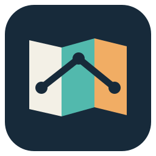

<p align="center"></p>
<h1 align="center">Code Atlas</h1>
<p align="center">コードと変更を、根拠付きで読み解く地図。</p>

Code Atlas は、既存プロジェクトや変更を根拠付きで説明する Agent Skills 集と、プロジェクト分類・解析履歴を一元管理するローカルCLIです。Skill は [Agent Skills](https://agentskills.io) 標準の形式なので、Claude Code、Codex、pi、OpenCode、Gemini CLI、Cursor で同じものを使えます。

## できること

用途ごとに独立した6つのSkillがあります。

| Skill | 用途 |
| --- | --- |
| `understand-project` | リポジトリ全体の目的・入口・構造を把握する |
| `understand-change` | Git差分から今回の変更を説明する |
| `visualize-architecture` | コンポーネントと境界を図にする |
| `visualize-data-flow` | データの出所・変換・保存先を追う |
| `review-change` | 変更に起因する具体的な不具合を調べる |
| `explain-business` | コードの意味を利用者・運用の言葉に翻訳する |

説明では必要に応じて次の3レイヤーを使います。

| レイヤー | 読者が知りたいこと |
| --- | --- |
| BUSINESS | 利用者や運用の仕事はどう変わるか |
| SYSTEM | コンポーネント、データ、実行時の流れはどう変わるか |
| CODE | どの条件や処理が変更を実現するか |

レポートはHTMLファイルで渡します。最初に**一文の結論**と**利用者への影響**を置き、その後に仕組みとコード上の根拠を示します。BUSINESS では専門用語を避け、誰が何をできるか、例外ではどうなるかを説明します。小さな変更は短い文章、条件の比較は表、手順や分岐は Business Flow など、読み手の疑問に合う形を選びます。

図の候補は Business Flow、Sequence、State、ER、Architecture/Component です。図は説明に必要な場合だけ使い、一つの図では一つの問いに答えます。Mermaid を表示できない環境では、読める文章や表で流れを伝えます。各主張と図の関係は差分または関連コードで裏付けます。[変更説明の例](examples/sample-explanation.md)と[業務フローの例](examples/business-flow.md)では、結論から読み始め、必要なら図と実装を追える構成を示しています。

## 構成

```text
code-atlas/
├── assets/icon.svg
├── skills/
│   ├── understand-project/
│   ├── understand-change/
│   │   ├── SKILL.md
│   │   └── references/
│   │       ├── code-reading.md
│   │       └── diagram-selection.md
│   ├── visualize-architecture/
│   ├── visualize-data-flow/
│   ├── review-change/
│   └── explain-business/
├── references/
│   ├── diagram-selection.md
│   ├── sequence.md
│   ├── er.md
│   ├── state.md
│   └── c4.md
├── code_atlas/                 # 分類・履歴CLI、HTMLレポート表示
├── bin/code-atlas              # 依存パッケージ不要の実行入口
├── eval/                       # Skillの評価シナリオとハーネス
├── tests/                      # CLIと評価ハーネスのテスト
├── scripts/
│   ├── make-fixture.sh
│   └── check-skills.py         # Skill単体配布の検証
└── examples/
    ├── fixture-walkthrough.md
    ├── sample-explanation.md
    └── business-flow.md
```

`skills/<name>/` が単体の配布単位です。ルートの `references/` は設計ガイドであり、Skillが実行時に必要とする参照はSkillフォルダ内に収めています。

## インストールと使い方

```bash
git clone https://github.com/meikocho1/code-atlas.git
cd code-atlas
ATLAS_DIR="$(pwd -P)"
```

**個人利用ではSkillをグローバル管理**します。このリポジトリを開発元にし、各エージェントの個人用Skillディレクトリからシンボリックリンクで参照します。解析対象ごとにSkillを作り直す必要はありません。

多くのエージェントは共通の `~/.agents/skills/` を読むため、リンク先は2箇所で足ります。

| エージェント | 読み込む個人用ディレクトリ | プロジェクト用 |
| --- | --- | --- |
| Claude Code | `~/.claude/skills/` | `.claude/skills/` |
| Codex | `~/.agents/skills/` | `.agents/skills/` |
| pi | `~/.agents/skills/`（ほかに `~/.pi/agent/skills/`） | `.agents/skills/` |
| OpenCode | `~/.agents/skills/`（ほかに `~/.config/opencode/skills/`、`~/.claude/skills/`） | `.agents/skills/` |
| Gemini CLI | `~/.agents/skills/`（ほかに `~/.gemini/skills/`） | `.agents/skills/` |
| Cursor | `~/.agents/skills/`（ほかに `~/.cursor/skills/`、`~/.claude/skills/`） | `.agents/skills/` |

```bash
# クローンしたディレクトリで一度だけ設定する
mkdir -p "$HOME/.agents/skills" "$HOME/.claude/skills"
for skill in "$ATLAS_DIR"/skills/*; do
  name=$(basename "$skill")
  ln -s "$skill" "$HOME/.agents/skills/$name"
  ln -s "$skill" "$HOME/.claude/skills/$name"   # Claude Code を使わないなら不要
done
```

Skillを更新すると、すべてのエージェントが同じ開発元を参照します。反映されない場合はセッションを再起動します。`~/.pi/agent/skills/` などエージェント専用のディレクトリにも同名のリンクを作ると重複になります（pi は最初に見つけた方を使い、警告を出します）。OpenCode と Cursor は `~/.claude/skills/` も読むので、同じリンク先が2箇所から見えます。

**チームで共有する場合**は、必要なSkillだけを対象リポジトリへコピーしてコミットします。この場合は各プロジェクトで使う版を固定できます。

```bash
# 対象リポジトリのルートで。.agents/skills は Codex・pi・OpenCode・Gemini CLI・Cursor が読む
mkdir -p .agents/skills
cp -R "$ATLAS_DIR/skills/understand-change" .agents/skills/

# Claude Code も使う場合
mkdir -p .claude/skills
cp -R "$ATLAS_DIR/skills/understand-change" .claude/skills/
```

同名Skillを個人用とプロジェクト用の両方に置くと選択が紛らわしくなるため、同じ環境ではどちらを使うか決めてください。複数Skillを配布する場合はプラグイン化も可能です。

対象リポジトリで「`understand-change` を使い、今回の変更を利用者への影響から説明して」と依頼します。Skill名を明示して呼ぶ方法はエージェントごとに違います。Claude Code は `/understand-change`、Codex は `$understand-change`、pi は `/skill:understand-change` です。OpenCode・Gemini CLI・Cursor では、依頼文でSkill名を挙げて頼みます。コミットやブランチを指定したいときは依頼文に含めます。

```text
$understand-change 直近のコミットを説明して。必要なら図を選んでください。
$understand-change main との差分を、業務影響から説明してください。
$explain-business この変更で利用者ができることを、専門用語を使わずに説明してください。
```

`understand-change` の既定対象は作業ツリーの staged、unstaged、関連する untracked の変更です。作業ツリーが空なら直近コミットを対象として明示します。リポジトリ全体の説明には `understand-project` を使います。

## プロジェクト分類と履歴

個人のユーザー領域に**1つのSQLiteデータベース**を置き、各GitリポジトリにプロジェクトIDを割り当てます。同じリポジトリのworktreeは同一プロジェクトにまとまります。分類は自由な `kind` と複数のタグで管理します。解析レポートはプロジェクトID、Skill、対象範囲、コミット、日時とともに追記保存し、過去の記録を上書きしません。対象リポジトリには自動でファイルを書きません。

CLIはPython標準ライブラリだけで動きます。開発元リポジトリ内では `python3 -m code_atlas` を使えます。どのディレクトリからも `code-atlas` と呼びたい場合は、実行ファイルにリンクします（`~/.local/bin` をPATHに含めてください）。

```bash
mkdir -p "$HOME/.local/bin"
ln -s "$ATLAS_DIR/bin/code-atlas" "$HOME/.local/bin/code-atlas"
```

```bash
python3 -m code_atlas project add /path/to/repository --kind service --tag customer-a
python3 -m code_atlas project list --tag customer-a
python3 -m code_atlas history add --repo /path/to/repository \
  --skill understand-change --scope worktree --report /path/to/report.md
python3 -m code_atlas history list --project /path/to/repository
python3 -m code_atlas history show RUN_ID
python3 -m code_atlas project relocate PROJECT_ID /new/repository/path
python3 -m code_atlas check-refs --repo /path/to/repository --rev HEAD --report /path/to/report.md
```

`check-refs` はレポート中の `path:line` と `path:開始-終了` を抜き出し、ファイルが存在して行番号がその範囲内にあるかを確かめます。`--rev` を付けるとそのコミットのファイルに、付けなければ作業ツリーに照合し、問題があれば終了コード1を返します。確かめるのは参照先の実在だけで、書かれた内容の正しさは判定しません。各Skillは `code-atlas` が入っていれば、報告前にこれで参照を確認します。

レポートの履歴保存は明示的に行います。Skillへ「この説明をCode Atlasの履歴に保存して」と依頼しても構いません。その場合Skillはレポートを `--report -`（標準入力）で渡し、対象リポジトリにファイルを作りません。変更のない作業ツリーを `--scope worktree` で記録しようとするとエラーになるので、コミット済みの内容は `--scope commit` で記録します。`--project` にはプロジェクトIDのほか、リポジトリ内の任意のディレクトリも指定できます。`CODE_ATLAS_DATA_DIR` でデータベースの保存先を変更できます。未コミット変更の履歴には差分本体を保存せず、その時点の内容のハッシュを記録します。そのため後からコードが変わると同じ状態を完全には再現できません。共有したいレポートは `history export` で書き出せます。

### 読みやすいHTMLレポート

各SkillはレポートをHTMLファイルで渡します。内部で作ったMarkdown原稿を、目次・結論の強調・業務影響を先に示す構成を備えたHTMLに変換します。Quartoを参考にしたCode Atlas専用の表示機能で、Python標準ライブラリだけで生成します。元のMarkdownと履歴は変わりません。HTMLファイルは解析対象のリポジトリ外に作成し、回答にリンクを添えます。

```bash
python3 -m code_atlas render --report /path/to/report.md /path/to/report.html
python3 -m code_atlas history export RUN_ID /path/to/saved-report.html
python3 -m code_atlas history export RUN_ID /path/to/saved-report.md --format md
```

出力はCSSを含む1つのHTMLファイルです。Mermaid図だけは表示時に外部のMermaidライブラリを読み込むため、図の描画にはインターネット接続が必要です。オフラインでも本文と図の元テキストは読めます。見出し、段落、箇条書き、表、引用、コードブロック、リンクというCode Atlasのレポート書式を対象にしており、複雑なMarkdownの完全再現は目的としていません。HTML内ではレポートに含まれる生のHTMLを文字として表示します。レポート内の `path:line` は根拠として表示しますが、Whiteboardのようなコードへのジャンプ機能はありません。既存ファイルへの上書きはしません。見た目は [`report.css`](code_atlas/report.css) で調整できます。

## 設計思想

1. **差分から始める。** 変更前後を確定し、関連コードを必要な範囲だけ追います。実装が示していない業務効果やシステム間の通信は描きません。
2. **説明の問いから図を選ぶ。** 順序なら Sequence、状態遷移なら State、データ関係なら ER など、読者の疑問と証拠に合わせます。ひとつの巨大な図に詰め込みません。
3. **図なしを正しい選択肢にする。** 文章や小さな Before/After 表が十分なら、図は省きます。
4. **根拠と不確実性を残す。** 重要な説明にファイル位置を添え、コードで確認できない実行結果は推測として扱います。
5. **必要なコードだけ読む。** 先に差分の概要と変更シンボルを掴み、構造索引があれば関連する呼び出し経路を一度に取得します。Code Wiki は該当モジュールへの案内に使い、現在のコードで裏付けます。索引がない場合も検索範囲と読み取り範囲を段階的に広げます。

この考え方は [diagramming](https://github.com/arjunprabhulal/agent-skills/blob/main/skills/docs/diagramming/SKILL.md) の「問いに合う図」、[architecture-diagram-generator](https://github.com/imtiazrayhan/agentscamp-library/blob/main/skills/architecture-diagram-generator/SKILL.md) の「実コードから関係を確かめる」、[CodeGraph](https://github.com/colbymchenry/codegraph/blob/main/site/src/content/docs/reference/mcp-server.md) のシンボル単位の探索、[code-wiki](https://github.com/NousResearch/hermes-agent/blob/main/optional-skills/software-development/code-wiki/SKILL.md) の読み取り範囲の制御を参考にしています。`review-change` は [OpenCodeReview](https://github.com/alibaba/open-code-review) の「間違えてはいけない工程（対象ファイルの選定・ルールの割り当て）は決定的に処理し、判断はエージェントに任せる」設計に倣い、全ファイルのカバレッジ確認と、報告前に指摘位置を読み直す工程を持ちます。`ocr` CLI が入っていれば、対象ファイルの選定とルールの取得を `ocr delegate` に任せます。Code Atlas はこれらを複製せず、**コードに根拠のある説明**と **BUSINESS / SYSTEM / CODE** に絞っています。構造索引やWiki、`ocr` がなくても動きます。

## 試す・検証する

追加の Python パッケージは不要です。次のスクリプトは一時的な Git リポジトリを作り、説明対象の変更を残します。第2引数でシナリオを選べます（一覧は `python3 eval/harness.py list`）。代表的な3つは次のとおりです。

| シナリオ | 変更 | 確かめること |
| --- | --- | --- |
| `state`（既定） | 注文キャンセルの状態遷移（未コミット） | State Diagram の選択 |
| `schema` | 返金テーブルの追加（コミット済み、理由はコミットメッセージ） | ERの多重度、直近コミットへのフォールバック、変更理由の出典明記 |
| `tiny` | 送料無料の境界値修正（未コミット） | 図を描かない判断 |

```bash
bash scripts/make-fixture.sh /tmp/code-atlas-demo schema
cd /tmp/code-atlas-demo
git status --short && git log --oneline
# このリポジトリ内で Skill を使い、変更を説明する
```

期待する観点と試用手順は [fixture walkthrough](examples/fixture-walkthrough.md)、`state` の出力例は [sample explanation](examples/sample-explanation.md) を参照してください。スクリプトは既存ディレクトリを上書きしません。

```bash
cd "$ATLAS_DIR"
python3 scripts/check-skills.py
python3 -m unittest discover -s tests -v
```

### Skillの自動評価

`eval/scenarios/` には25件のシナリオがあります（train 14 / val 5 / test 6）。各シナリオは、最初のコミット（`base/`）、その上に重ねる変更（`change/`）、依頼文と期待値（`scenario.json`）で構成されます。`eval/harness.py` は、シナリオのリポジトリを作り、Claude Code に Skill を使わせ、回答を機械的に採点します。

```bash
python3 eval/harness.py list --split val                           # シナリオ一覧（train / val / test）
python3 eval/harness.py run tiny state --model sonnet              # 実行して採点（トークンを消費します）
python3 eval/harness.py score tiny /path/to/built/repo report.md   # 手元の回答だけを採点
```

採点項目は、図の種類が期待どおりか、`path:line` が実在するか（`check-refs` と同じ判定）、必須の事実を含むか、誤った主張を含まないか、変更理由を出典付きで書くか「確定できない」と書くか、の5つです。`soft` はその平均、`hard` は全項目が満点のときだけ1です。実行時は個人設定（フックやプラグイン、個人用Skill）を読み込まず、Skill は重複しない名前で対象リポジトリに入れます。採点は英語の回答を前提にした正規表現なので、依頼文で英語の回答を指定しています。

## ライセンス

MIT。詳細は `LICENSE` を参照してください。
