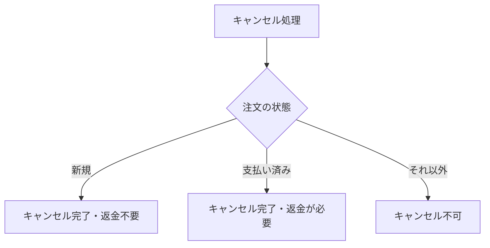

# 注文のキャンセル判定

**結論:** 新規または支払い済みの注文はキャンセルできます。支払い済みの場合は、返金が必要だと別の処理に知らせます。発送済みの注文はキャンセルできません（`order.py:21-27`）。

**対象:** `state` 例題の現在の作業ツリー。

## できることと条件（BUSINESS）

下の図は、注文の状態によって結果がどう分かれるかを示します。

新規なら返金なしでキャンセルし、支払い済みなら返金が必要という合図を返します。それ以外の状態は受け付けません（`order.py:21-27`）。

## 仕組みと根拠（SYSTEM / CODE）

注文の状態を確認してから `cancelled` に変えます。支払い済みかどうかが返金の合図を決めます（`order.py:21-27`）。

**確認できないこと:** この例題には利用者向けの画面がなく、誰がキャンセルを操作するかは分かりません。返金の実行も含まれていません（`README.md:4`, `order.py:21-27`）。
