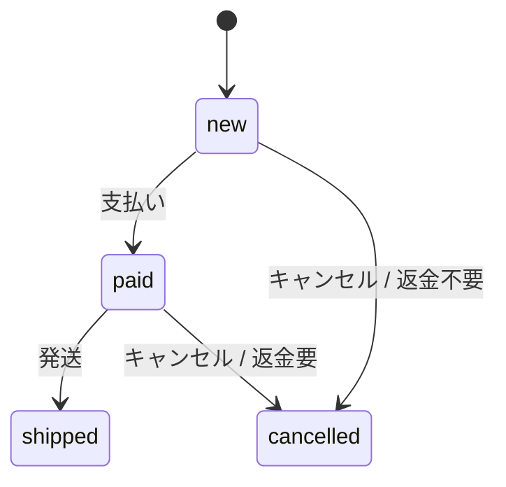

# 注文をキャンセルできる条件が増えました

**結論:** 未発送の注文はキャンセルできます。支払い済みなら「返金が必要」という合図を返しますが、返金処理そのものは行いません。

**対象:** `Baseline order lifecycle` コミットから現在の作業ツリーまで。未追跡の `test_order.py` を含みます。

```atlas-stats
変更ファイル: 3 | 未追跡 1 を含む
追加行: +37
削除行: −0
公開関数: +1 | `cancel()`
```

## 利用者への影響（BUSINESS）

```atlas-compare
Before: 注文をキャンセルする手段がない
After: 新規・支払い済みの注文はキャンセルできる
After: 発送済みの注文はキャンセルできない
```

支払い済みの注文をキャンセルすると、返金が必要かどうかをこの機能を使う別の処理に伝えます（`order.py:21-27`, `README.md:4`）。

> [!WARNING]
> 返金の実行や保存処理はこの変更に含まれていません。利用者が画面上でどう操作するかも、このコードからは分かりません。

## どこで起きるか（SYSTEM）

注文の状態は実行中のメモリに保持され、`order.py` 内で変更されます。データベースや決済サービスへの連絡は、この処理にはありません（`order.py:4-6`, `order.py:21-27`）。



キャンセルできるのは `new` と `paid` からだけです。`shipped` からのキャンセル経路はありません（`order.py:9-27`）。

## 実装の根拠（CODE）

`cancel()` は注文の状態が `new` または `paid` かを確かめ、それ以外ならエラーにします。元の状態が `paid` だったかを記録してから `cancelled` に変更します（`order.py:21-27`）。

変更の大半はテストです。実装の追加は1関数に収まっています。

```atlas-chart diff ファイル別の変更行数
`test_order.py`: +27 −0
`order.py`: +9 −0
`README.md`: +1 −0
```

```atlas-chart share 追加行の内訳
テスト: 27
実装: 9
ドキュメント: 1
```

> [!NOTE]
> 変更は未コミットで、PRや課題がないため、キャンセルを追加した理由は確定できません。
