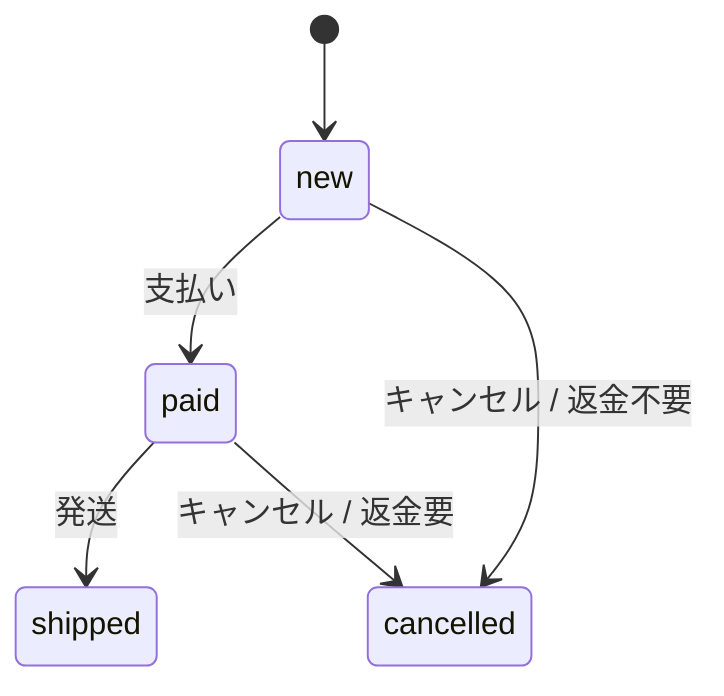

# 注文をキャンセルできる条件が増えました

**結論:** 未発送の注文はキャンセルできます。支払い済みなら「返金が必要」という合図を返しますが、返金処理そのものは行いません。

**対象:** `Baseline order lifecycle` コミットから現在の作業ツリーまで。未追跡の `test_order.py` を含みます。

## 利用者への影響（BUSINESS）

- 新規・支払い済みの注文はキャンセルできます。発送済みの注文はキャンセルできません（`order.py:21-27`）。
- 支払い済みの注文をキャンセルすると、返金が必要かどうかをこの機能を使う別の処理に伝えます。利用者が画面上でどう操作するかは、このコードからは分かりません（`order.py:21-27`, `README.md:4`）。

## どこで起きるか（SYSTEM）

注文の状態は実行中のメモリに保持され、`order.py` 内で変更されます。データベースや決済サービスへの連絡は、この処理にはありません（`order.py:4-6`, `order.py:21-27`）。

下の図は、注文がどの状態からキャンセルできるかを示します。

キャンセルできるのは `new` と `paid` からだけです。`shipped` からのキャンセル経路はありません（`order.py:9-27`）。図が表示されない環境では「新規・支払い済み → キャンセル可、発送済み → キャンセル不可」と読んでください。

## 実装の根拠（CODE）

`cancel()` は注文の状態が `new` または `paid` かを確かめ、それ以外ならエラーにします。元の状態が `paid` だったかを記録してから `cancelled` に変更します（`order.py:21-27`）。テストには両方のキャンセル経路と、発送後に拒否する例があります（`test_order.py:7-23`）。

**確認できないこと:** 返金の実行や保存処理は、この変更に含まれていません。変更は未コミットで、PRや課題がないため、キャンセルを追加した理由も確定できません。
