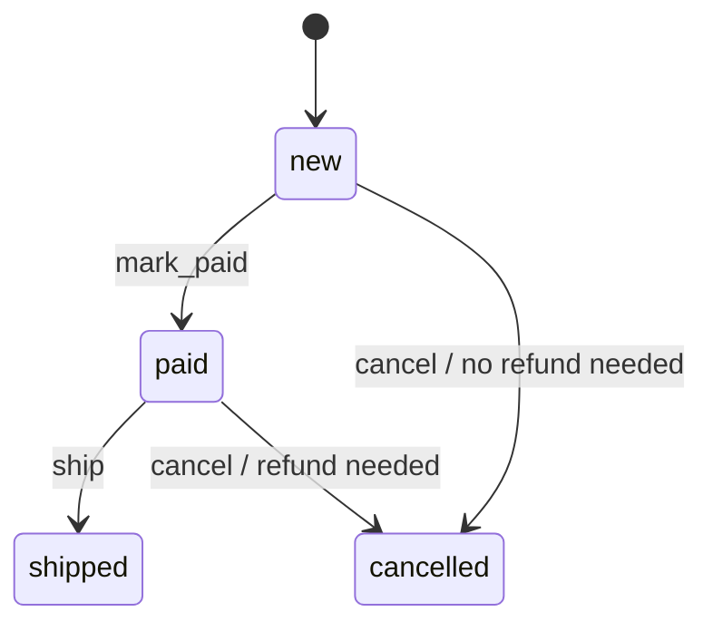

# Example output from the fixture

**Scope:** `Baseline order lifecycle` commit → current worktree, including untracked `test_order.py`.

**Summary:** An order can now move from `new` or `paid` to `cancelled`; cancelling a paid order signals that a refund is needed.

## BUSINESS

An unshipped order can be cancelled. A paid cancellation returns a refund-needed signal, but this change does not issue the refund. The fixture has no user interface, so it does not show who can trigger cancellation (`order.py:21-27`, `README.md:4`).

## SYSTEM

The state change happens in one in-memory `Order` module. No database, payment service, or API call is present in the changed path (`order.py:4-6`, `order.py:21-27`).

The useful visual question is: **Which order transitions are now allowed?** A State Diagram answers it directly.

Cancellation adds two transitions into `cancelled`; `shipped` has no cancellation transition (`order.py:9-27`).

## CODE

`cancel()` accepts only `new` and `paid`, raises `ValueError` otherwise, records whether the previous state was `paid`, and then sets the state to `cancelled` (`order.py:21-27`). The new tests cover both allowed paths and rejection after shipping (`test_order.py:7-23`).

**Limit:** The Boolean return value describes refund need; payment reversal and persistence are outside this fixture. The change is uncommitted and no PR or issue was supplied, so why cancellation was added is not established; the README describes the new behavior, not its motivation.
